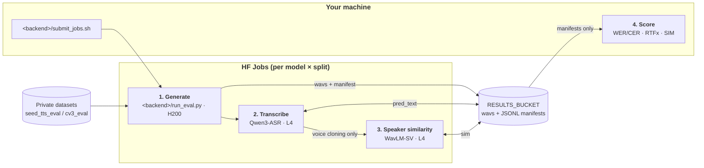
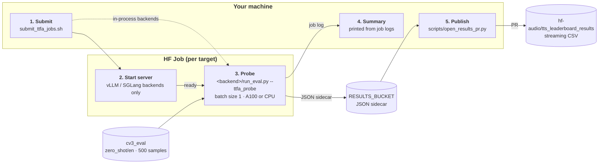

# Open TTS Leaderboard

This repository contains the code for the Open TTS Leaderboard. The leaderboard is a Gradio Space that allows users to compare TTS models on a variety of datasets. The leaderboard is hosted at [hf-audio/open_tts_leaderboard](https://huggingface.co/spaces/hf-audio/open_tts_leaderboard).

[Hugging Face Jobs](https://huggingface.co/docs/hub/en/jobs) are used to launch evaluations in a reproducible manner. Each model family contains its own model folder with the necessary scripts for launching the evaluation.

The following datasets are used in the Open TTS Leaderboard:
1. [Seed TTS Eval](https://github.com/BytedanceSpeech/seed-tts-eval) (`tts` config): `en` (English) and `zh` (Chinese).
2. [CV3 Eval](https://github.com/QwenAudio/CV3-Eval): `en`, `zh`, `fr` (French), `es` (Spanish), `ja` (Japanese), `ko` (Korean), `it` (Italian), `de` (German), and `ru` (Russian) (`zero_shot` config, 500 samples per language).
3. [MiniMax Multilingual](https://huggingface.co/datasets/MiniMaxAI/TTS-Multilingual-Test-Set) (`tts` config): 100 samples x 24 languages. (Thai is scored with CER; Ukrainian is not supported by ASR)

While human preference is the ultimate decider, **arenas cannot scale to keep up with the pace of TTS releases**. To this end, we use objective metrics to evaluate models on complementary aspects of performance:

1. **Intelligibility**: word/character error rate (WER and CER) between the target text and the generated audio's transcript, using [Qwen3 ASR](https://huggingface.co/Qwen/Qwen3-ASR-1.7B-hf) (top ranking open-source model on the [Open ASR Leaderboard](https://huggingface.co/spaces/hf-audio/open_asr_leaderboard)).
2. **Speed**: inverse real-time factor (RTFx) for batched offline inference on an H200 GPU, and time-to-first-audio (TTFA) for quantifying streaming batch size 1 latency on an A100 GPU and CPU.
3. **Speaker similarity** by computing the cosine similarity (SIM) between [WavLM speaker embeddings](https://huggingface.co/bezzam/wavlm_large_finetune_seed_tts_eval) of the generated audio and the reference clip. Note that not all models support voice cloning, so those models are omitted from this evaluation.

By relying on objective metrics **evaluating a model drops from a couple weeks (for collecting votes) to a couple hours** ⚡

Our intention with this leaderboard is for it to be **shaped by the community**; we want to hear your feedback so the evaluations stay relevant and insightful.

## Table of contents

- [Setup for running evaluations](#setup-for-running-evaluations)
- [Batch evaluation (main tab)](#batch-evaluation-main-tab)
  - [Publishing results](#publishing-results)
- [Adding a new model](#adding-a-new-model)
- [Time-to-first audio (streaming) evaluation](#time-to-first-audio-streaming-evaluation)
- [Citation](#citation)

## Setup for running evaluations

#### 1. Hugging Face account:
- Create an account at https://huggingface.co/ and add credits for HF Jobs: https://huggingface.co/settings/billing
- Create a [WRITE token](https://huggingface.co/settings/tokens/new?tokenType=write) and add it as an environment variable
```bash
echo 'export HF_TOKEN="your_token_here"' >> ~/.bashrc
source ~/.bashrc
# double-check it got added
tail -n 3 ~/.bashrc
```
- Create a Storage Bucket to store results: https://huggingface.co/new-bucket

#### 2. Create a virtual environment for launching HF Jobs:
```
# Clone the repository
git clone git@github.com:ebezzam/open-tts-leaderboard.git
cd open-tts-leaderboard

# Create environment, e.g. with conda
conda create -n tts_leaderboard python=3.12 -y
conda activate tts_leaderboard
(tts_leaderboard) pip install -r requirements.txt
```

#### 3. Prepare the (private) datasets

Unfortunately the licenses of [Seed TTS](https://github.com/BytedanceSpeech/seed-tts-eval) and [CV3](https://github.com/QwenAudio/CV3-Eval) do not allow us to redistribute the datasets. However, the following scripts can be used to make personal (private) copies so that they are compatible with our evaluation scripts.
```
# seed tts eval
# -- download
(tts_leaderboard) pip install gdown
(tts_leaderboard) gdown 1GlSjVfSHkW3-leKKBlfrjuuTGqQ_xaLP -O seedtts_testset.tar
(tts_leaderboard) tar -xf seedtts_testset.tar
# -- upload to your account on HF
(tts_leaderboard) python scripts/prepare_seed_tts_eval.py YOUR_USERNAME/seed_tts_eval

# cv3 eval
# -- download
(tts_leaderboard) git clone git@github.com:QwenAudio/CV3-Eval.git
# -- upload to your account on HF
(tts_leaderboard) python scripts/prepare_cv3_eval.py YOUR_USERNAME/cv3_eval

# minimax eval
# -- download
(tts_leaderboard) hf download MiniMaxAI/TTS-Multilingual-Test-Set --repo-type dataset --local-dir minimax_testset
# -- upload to your account on HF
(tts_leaderboard) python scripts/prepare_minimax_eval.py YOUR_USERNAME/minimax_eval
```
Keep the repo names (`seed_tts_eval`, `cv3_eval`, `minimax_eval`) as above, so that `DATASET_NAMESPACE=YOUR_USERNAME` points every job at your copies.


#### 4. Smoke test

A quick smoke test (Transformers backend, single model, 8 samples of the English datasets) can verify that your setup is working:

```bash
DATASET_NAMESPACE="YOUR_USERNAME" \
RESULTS_BUCKET="YOUR_USERNAME/your_bucket_name" \
MAX_EVAL_SAMPLES=8 ONLY_LANGS="en" \
bash transformers/submit_jobs.sh "facebook/seamless-m4t-v2-large 32 "

### EXAMPLE OUTPUT
********************************************************************************
Results per dataset:
********************************************************************************
facebook/seamless-m4t-v2-large | bezzam-cv3_eval_zero_shot_en: WER = 4.55 %, RTFx = 23.01
facebook/seamless-m4t-v2-large | bezzam-seed_tts_eval_tts_en: WER = 0.00 %, RTFx = 19.46

********************************************************************************
Composite Results:
********************************************************************************
facebook/seamless-m4t-v2-large: WER = 2.27 %
facebook/seamless-m4t-v2-large: RTFx = 21.19
********************************************************************************
```


## Batch evaluation (main tab)

Each model family has its own folder (e.g. [kokoro/](kokoro/), [voxcpm2/](voxcpm2/), [transformers/](transformers/)) with a `submit_jobs.sh` that is run **locally** and submits HF Jobs to HF servers. The orchestration shared by all backends lives in [scripts/tts_jobs_common.sh](scripts/tts_jobs_common.sh).

For each (model, dataset split) pair, the pipeline runs three sequential HF Jobs (two if the model is not voice cloning), followed by scoring on your machine. The splits of a model run in parallel; models run one after another.



1. **Generate** (`generate`): the backend's `run_eval.py` synthesizes every sample of the split and writes the wavs plus a JSONL manifest to `RESULTS_BUCKET`, in a folder per model.
2. **Transcribe** (`transcribe`): [transformers/transcribe.py](transformers/transcribe.py) transcribes the wavs with [Qwen3-ASR-1.7B](https://huggingface.co/Qwen/Qwen3-ASR-1.7B-hf), using the split's language as a hint.
3. **Speaker similarity** (`sim`, voice cloning only): [transformers/score_similarity.py](transformers/score_similarity.py) compares each generated clip with its reference prompt, using the [Seed TTS Eval](https://github.com/BytedanceSpeech/seed-tts-eval#metrics) speaker-verification model (WavLM-large + ECAPA-TDNN, mirrored [here](https://huggingface.co/bezzam/wavlm_large_finetune_seed_tts_eval)).
4. **Score** (on your machine): the model's manifests are synced to `./results/<model>` and scored per language:
   - **WER** after text normalization (CER for `zh`, `ja`, `ko`)
   - **RTFx**: total audio duration divided by total generation time, measured in stage 1
   - **SIM**: mean speaker similarity, for voice cloning only

The stages are separate jobs because the TTS, ASR and speaker-similarity models have conflicting dependencies: stage 1 uses the backend's own Docker Space image, and stages 2 and 3 share [bezzam/evals](https://huggingface.co/spaces/bezzam/evals).

| Stage | Flavor | Hardware |
|---|---|---|
| 1. Generate | `h200` | 1x Nvidia H200 (141 GB) |
| 2. Transcribe | `l4x1` | 1x Nvidia L4 (24 GB) |
| 3. Speaker similarity | `l4x1` | 1x Nvidia L4 (24 GB) |

RTFx is measured in stage 1, so every model is generated on the **same** flavor (`h200`); don't override `FLAVOR` in a backend. See the [HF Jobs documentation](https://huggingface.co/docs/huggingface_hub/main/en/guides/jobs#select-the-hardware) for pricing.

All outputs are written to the bucket set by `RESULTS_BUCKET` (default: the official [hf-audio/tts_leaderboard_h200](https://huggingface.co/buckets/hf-audio/tts_leaderboard_h200)).

Useful environment variables (see [scripts/tts_jobs_common.sh](scripts/tts_jobs_common.sh) for all of them):

| Variable | Default | Purpose |
|---|---|---|
| `DATASET_NAMESPACE` | `bezzam` | Namespace holding your private `seed_tts_eval` / `cv3_eval` / `minimax_eval` copies |
| `RESULTS_BUCKET` | `hf-audio/tts_leaderboard_h200` | Bucket the jobs write to |
| `MAX_EVAL_SAMPLES` | `-1` (all) | Cap samples per split, e.g. `8` for a smoke test |
| `ONLY_LANGS` | (all) | Only run the configured splits for these languages, e.g. `"en zh"` |
| `STAGES` | `generate transcribe sim` | Subset of stages, e.g. `"transcribe sim"` to re-score existing wavs |
| `VOICE_CLONE` | `false` | Clone the prompt speaker (backends that support both modes) |
| `ASR_OVERWRITE` / `SIM_OVERWRITE` | `false` | Recompute `pred_text` / `sim` instead of resuming. **Set `SIM_OVERWRITE=true` after regenerating audio**, otherwise old SIM scores are carried over |
| `ORG_NAME` | (none) | Run the jobs under an organization's namespace |

Examples:
```bash
# all configured models + splits of a backend
bash kokoro/submit_jobs.sh

# a specific model (overrides the backend's MODEL_CONFIGS; format is backend-specific)
VOICE_CLONE=true bash transformers/submit_jobs.sh "vibevoice/VibeVoice-1.5B-hf 32 512"

# re-score a local copy of the manifests, e.g. for one language
python scripts/score_model.py --model_id hexgrad/Kokoro-82M --language en
```

Job logs are written to `<backend>/job_logs/`. Live status is at https://huggingface.co/settings/jobs.

#### Publishing results

The leaderboard reads its CSVs from [hf-audio/tts_leaderboard_results](https://huggingface.co/datasets/hf-audio/tts_leaderboard_results) (private dataset). [scripts/open_results_pr.py](scripts/open_results_pr.py) scores the bucket manifests the same way as above and opens a PR on that repo with the model's rows. Without `--open_pr` it is a dry run:
```bash
python scripts/open_results_pr.py --model_id openbmb/VoxCPM2 \
    --license apache-2.0 --voice_cloning yes --batch_inference no \
    --num_languages 9 --model_size_b 0.5 --transformers no --open_pr
```

A new versions entry should be set in the HF space code [here](https://huggingface.co/spaces/hf-audio/open_tts_leaderboard/blob/main/leaderboard_data.py#L50).


## Adding a new model

> [!TIP]
> **Let your coding agent do the heavy lifting!** Ask it to:
> - make a new folder to evaluate the new model, linking it to a documentation page with usage
> - use batch inference if possible
> - implement the TTFA probe if the model supports streaming
> - (if you give it permission to your HF account) make a Docker Space to run the model via HF Jobs, taking inspiration from one of the existing configurations [here](https://huggingface.co/collections/bezzam/tts-eval)

1. **Create the environment image.** Create a **public** [Docker Space](https://huggingface.co/new-space?sdk=docker) (HF Jobs can't pull private ones), e.g. `YOUR_USERNAME/evals-<backend>`, whose `Dockerfile` installs the model's dependencies. It only needs the Dockerfile; the eval scripts are injected at runtime. See the existing Spaces [here](https://huggingface.co/collections/bezzam/tts-eval). Models that run with `transformers` can instead be added to the [transformers/](transformers/) backend.
2. **Write `<backend>/run_eval.py`**, which evaluates one dataset split. The shared helpers in [scripts/run_eval_utils.py](scripts/run_eval_utils.py) handle the parts common to every backend, so the script mostly contains the model-specific code. It should:
   - synthesize the `text` column, cloning from `prompt_audio` / `prompt_text` when `--voice_clone` is set (off by default)
   - time generation only, after `--warmup_steps` untimed warm-up batches (default 2), so RTFx is fair
   - write the wavs and a manifest with the shared helpers
   - optionally support `--ttfa_probe N` so the model can be included in the [TTFA evaluation](#time-to-first-audio-streaming-evaluation)

   [kokoro/run_eval.py](kokoro/run_eval.py) is a short fixed-voice example, and [voxcpm2/run_eval.py](voxcpm2/run_eval.py) is a voice-cloning example.
3. **Write `<backend>/submit_jobs.sh`**, which sources [scripts/tts_jobs_common.sh](scripts/tts_jobs_common.sh) and then:
   - sets `TTS_SPACE` (your Docker Space) and `RUN_EVAL_INJECT="$(inject_run_eval)"`
   - defines `generate_stage()`, the `hf jobs run` command for stage 1
   - sets `SUPPORTS_VOICE_CLONE=true` if the model can clone, and optionally defines `supports_language()` to skip splits the model can't synthesize
   - sets `DATASET_CONFIGS` and `MODEL_CONFIGS`, then calls `run_pipeline`
4. **Smoke test** with `MAX_EVAL_SAMPLES=8 ONLY_LANGS="en" bash <backend>/submit_jobs.sh`, then run the full evaluation.
5. **Open a PR** on this repository with the new backend folder, using the [pull request template](.github/pull_request_template.md). Include the scores printed at the end of the run. A maintainer will then publish the results to the leaderboard with `scripts/open_results_pr.py`.


## Time-to-first audio (streaming) evaluation

Time-to-first-audio (TTFA) measures how long a caller waits before it has audio it can start playing:
- models that stream: time from the request to the first audio chunk
- models that don't stream: time from the request until generation finishes, because playback can't start any earlier

[submit_ttfa_jobs.sh](submit_ttfa_jobs.sh) launches one HF Job per entry in `TTFA_TARGETS`. Each job runs the backend's own `run_eval.py` with `--ttfa_probe`, so it measures the same code path as the main eval. Every model uses the same settings so the numbers are comparable:
- **batch size 1**, because TTFA is a per-request latency
- **the full split** of **CV3-Eval `zero_shot/en`** (500 samples). The first 3 are discarded as warm-up, and TTFA is reported as p50, p90 and p95.
- **no voice cloning** (`VOICE_CLONE=false`): each model uses its own default voice
- **`a100-large`** (1x Nvidia A100, 80 GB) for GPU, and **`cpu-upgrade`** (8 vCPU, 32 GB) with `TTFA_DEVICE=cpu`.



The probe only writes a small JSON file to the model's bucket folder (no wavs or manifests), so it is safe to run for models that already have results. GPU, CPU and alternative-engine results are kept side by side.

```bash
# all targets in TTFA_TARGETS
bash submit_ttfa_jobs.sh
# selected backends / labels / model ids
bash submit_ttfa_jobs.sh kokoro breeze-tts
# on CPU
TTFA_DEVICE=cpu bash submit_ttfa_jobs.sh kokoro
```

To add a model, implement `--ttfa_probe` in its `run_eval.py` (see [scripts/ttfa_probe.py](scripts/ttfa_probe.py)) and add it to `TTFA_TARGETS` in [submit_ttfa_jobs.sh](submit_ttfa_jobs.sh).

The leaderboard reports the p50 and p95 TTFA and the batch-1 RTFx (`python scripts/open_results_pr.py --model_id <model> --targets streaming`). **Batch-1 RTFx is not the leaderboard RTFx**, which is measured at each backend's real batch size.


## Citation 

If you use the Open TTS Leaderboard, please cite it along with the benchmarks it evaluates on:

```bibtex
@misc{open_tts_leaderboard,
    title={Open TTS Leaderboard},
    author={Bezzam, Eric and others},
    year={2026},
    url={https://huggingface.co/spaces/hf-audio/open_tts_leaderboard},
}

@article{anastassiou2024seedtts,
  title   = {Seed-TTS: A Family of High-Quality Versatile Speech Generation Models},
  author  = {Anastassiou, Philip and others},
  journal = {arXiv preprint arXiv:2406.02430},
  year    = {2024}
}

@article{du2025cosyvoice3,
  title   = {CosyVoice 3: Towards In-the-wild Speech Generation via Scaling-up and Post-training},
  author  = {Du, Zhihao and others},
  journal = {arXiv preprint arXiv:2505.17589},
  year    = {2025}
}
```
